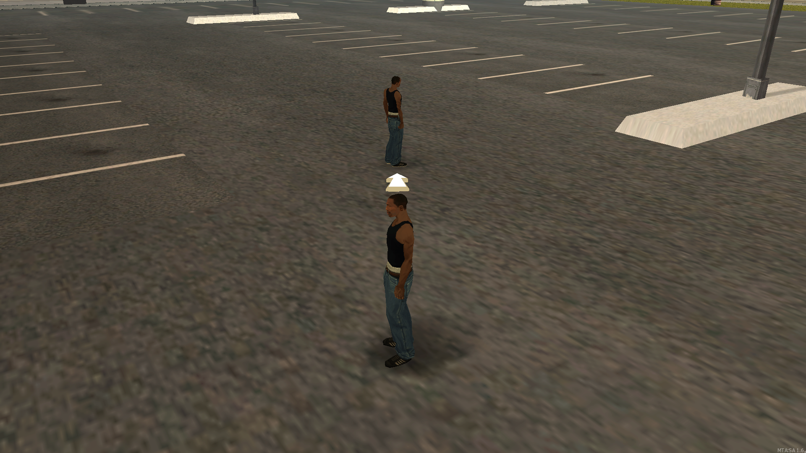

# 🚩 Localizador por seta.



> Script simples para ajudar o jogador a se localizar e alcançar seu destino.

## Instalação

1. Faça o download do MTA:SA em sua maquina: https://multitheftauto.com/
2. Faça o clone ou download do repositório.
3. Coloque o projeto na pasta: "MTA San Andreas 1.6\server\mods\deathmatch\resources\mta-gps".

## Exports/triggers

#### Setar GPS.

```lua
exports["mta-gps"]:setGPS(player, x, y, z)
```

| Parâmetro | Tipo      | Descrição                     |
| :-------- | :-------- | :---------------------------- |
| `player`  | `element` | Player que será criado a seta |
| `x`       | `float`   | Posição x do mapa             |
| `y`       | `float`   | Posição y do mapa             |
| `z`       | `float`   | Posição z do mapa             |

#### Setar GPS Via trigger.

```lua
triggerClientEvent(player, "arrow_gps:setGPS", player, x, y, z)
```

| Parâmetro | Tipo      | Descrição                     |
| :-------- | :-------- | :---------------------------- |
| `player`  | `element` | Player que será criado a seta |
| `x`       | `float`   | Posição x do mapa             |
| `y`       | `float`   | Posição y do mapa             |
| `z`       | `float`   | Posição z do mapa             |

## Uso/Exemplos

```lua
addCommandHandler("localizar", function(player)
    local target = getRandomPlayer()
    local targetX, targetY, targetZ = getElementPosition(target)
    exports["mta-gps"]:setGPS(player, targetX, targetY, targetZ)
end)
```
